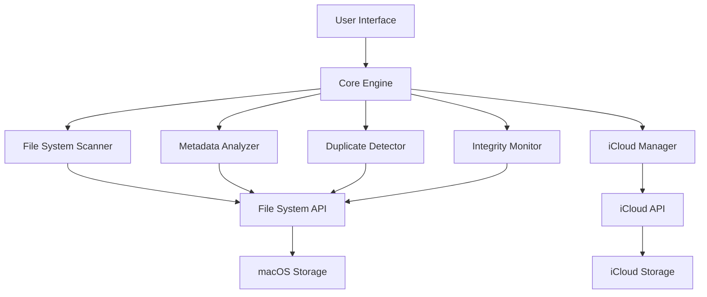

# MacOS Storage Optimization & File Management System: Product Blueprint

## 1. Product Vision & Objectives

### Vision Statement
DiskOptimizer Pro delivers unprecedented visibility and control over macOS storage through an intuitive Finder-like interface, empowering users to reclaim space, optimize system performance, and maintain data integrity while clearly distinguishing between critical system files and user-manageable content.

### SMART Goals
- Reduce average system storage consumption by 30% within first use
- Decrease duplicate file storage by 40% for active users
- Achieve 98% user confidence in system file safety through clear visual indicators
- Maintain sub-5-second response time for scanning drives up to 2TB

### Competitive Analysis (vs. CleanMyMac, DaisyDisk, OmniDiskSweeper)
- **Strengths**: Native macOS integration, real-time visualization, system file protection, integrated iCloud optimization
- **Weaknesses**: Initial learning curve, requires permissions explanation
- **Opportunities**: Target prosumer market segment, capitalize on iCloud storage limitations
- **Threats**: Apple built-in storage recommendations, subscription fatigue

## 2. User Workflow & Experience

### Primary User Journeys

#### 1. Initial Storage Analysis
1. User launches application, presented with welcome screen explaining permissions needs
2. Grants necessary permissions via macOS security dialogs (one-time setup)
3. Application scans system storage with animated progress bar (30-60 seconds typical)
4. Presents interactive pie chart visualization of storage categories:
   - System (protected)
   - Applications
   - User Documents
   - Media
   - Caches
   - Duplicates
   - Other
5. User can click any segment to drill down into subcategories

#### 2. System Data Management
1. User selects "System Data" category from visualization or sidebar
2. Application displays categorized breakdown of system data components:
   - System caches (with safety indicators)
   - Application support files
   - Logs
   - iOS device backups
   - Temporary installation files
3. User can sort by size, date, or access frequency
4. System-critical files appear with lock icons and "Do Not Touch" indicators
5. Safe-to-remove files offer "Clean" action buttons
6. User selects items and initiates cleaning action
7. Application requests elevated permissions when required
8. Provides real-time feedback during cleaning process
9. Shows space recovered and updated visualization

#### 3. Duplicate Detection & Resolution
1. User initiates duplicate scan from toolbar or menu
2. Selects scope of scan (all drives, specific folders, or file types)
3. Application performs byte-level and content-aware similarity analysis
4. Presents results in grouped format showing:
   - Exact duplicates (100% match)
   - Similar files (75-99% match)
   - Name-only duplicates (same filename, different content)
5. User can preview files directly in application
6. Select preferred version to keep via smart selection tools:
   - Keep newest/oldest
   - Keep highest quality
   - Keep files in specific locations
7. Reviews selection with clear indication of space to be recovered
8. Confirms deletion with option to move to trash or permanently delete

#### 4. iCloud Optimization
1. User navigates to "iCloud" section from sidebar
2. Application analyzes current iCloud storage configuration
3. Displays visualizations of:
   - Local vs. cloud storage usage
   - Download status of cloud documents
   - Optimization opportunities
4. User can toggle "Store in iCloud" settings for document categories
5. Can select individual files to "Remove Download" while keeping in cloud
6. Application estimates space savings before confirmation
7. Performs optimization with progress indicators

#### 5. File Integrity Monitoring
1. User enables integrity monitoring feature
2. Selects critical folders to monitor (default recommendations provided)
3. Application creates file hash baseline during initial setup
4. Runs periodic or on-demand verification scans
5. Alerts user to unauthorized modifications via notification
6. Provides detailed comparison and restoration options

## 3. Technical Architecture

### Stack
- **Core Engine**: C/C++ with native macOS frameworks
- **GUI Layer**: Swift/Objective-C with AppKit
- **Database**: SQLite for file metadata and history
- **Visualization**: Metal-accelerated graphics for fluid animations

### Permission Model
- Standard operations: Standard user permissions
- System file analysis: Read-only access
- System optimization: Temporary elevated permissions via macOS authentication
- Background monitoring: XPC service with limited persistent permissions

## 4. UI/UX Specifications

### Design Language
- Native macOS aesthetic with familiar Finder patterns
- Clear visual hierarchy distinguishing system vs. user content
- Color-coding system:
  - Green: Safe to modify/delete
  - Yellow: Caution, but modifiable
  - Red: Protected system files
  - Blue: iCloud-related content

### Key Interaction Points

#### Visualization Controls
- **View Toggle**: Switches between pie chart, treemap, and list views
- **Timeline Slider**: Shows storage changes over time
- **Drill-Down Navigation**: Click segments to explore subcategories
- **Breadcrumb Trail**: Shows current location in storage hierarchy

#### File Management
- **Contextual Actions**: Right-click menu with appropriate actions
- **Batch Operations**: Multiple selection with smart grouping
- **Drag-and-Drop**: Move files between locations
- **Quick Preview**: Spacebar for Quick Look integration

#### System Protection
- **Permission Requests**: Clear explanations of why permissions needed
- **Undo History**: 30-day record of cleaning operations
- **Recovery Options**: Restore accidentally removed files
- **Whitelist/Blacklist**: Custom rules for protected locations

## 5. Implementation Timeline

### Phase 1: Core Analysis Engine (8 weeks)
- File system scanning foundation
- Basic UI implementation
- Storage visualization components
- System vs. user file classification

### Phase 2: Management Tools (6 weeks)
- Duplicate detection algorithms
- File cleaning operations
- Permission management system
- iCloud integration

### Phase 3: Advanced Features (6 weeks)
- Timeline analysis
- File integrity monitoring
- Advanced visualization options
- Performance optimization

### Phase 4: Testing & Refinement (4 weeks)
- Beta testing program
- Performance benchmarking
- Security audit
- UX refinement

## 6. Future Roadmap

### Phase 2 Features
- Cloud storage provider integration beyond iCloud
- Snapshot management for Time Machine
- Network drive analysis and optimization
- Command-line interface for power users
- Scheduled maintenance operations

## 7. Performance Targets
- Initial scan under 60 seconds for 1TB drive
- Memory footprint under 250MB during standard operation
- CPU usage below 10% during background monitoring
- UI response under 100ms for all interactions

This comprehensive blueprint provides a clear vision for a sophisticated yet user-friendly macOS storage management application that respects system integrity while providing powerful optimization capabilities.